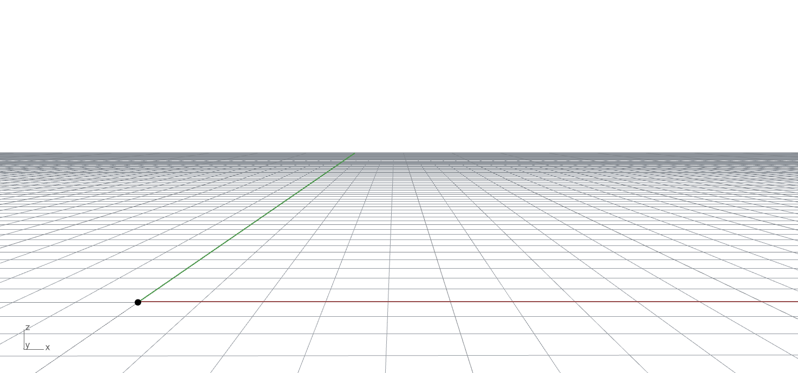
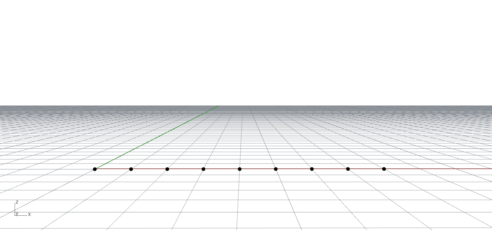
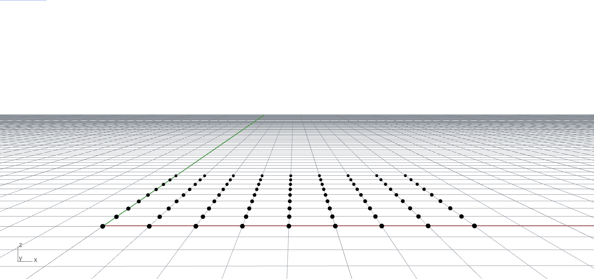
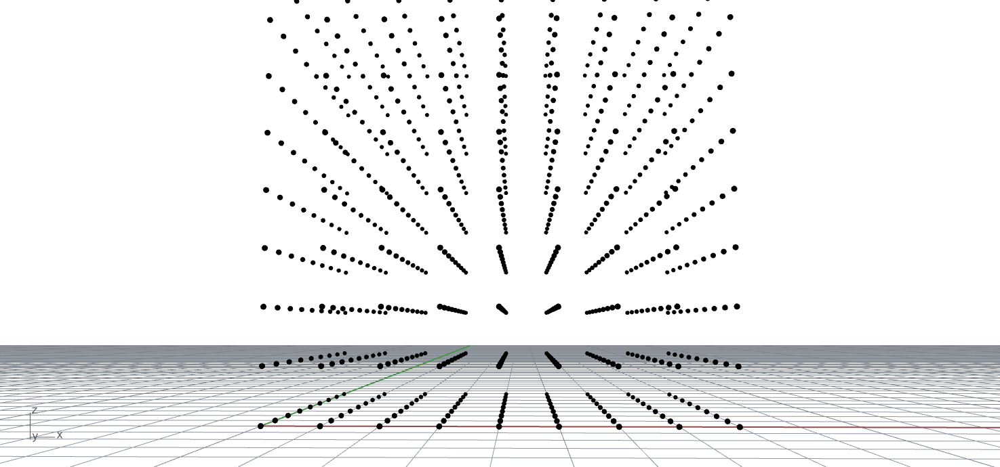
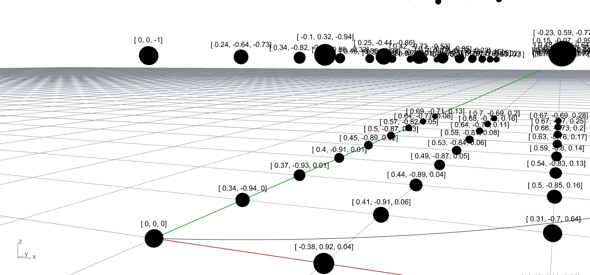
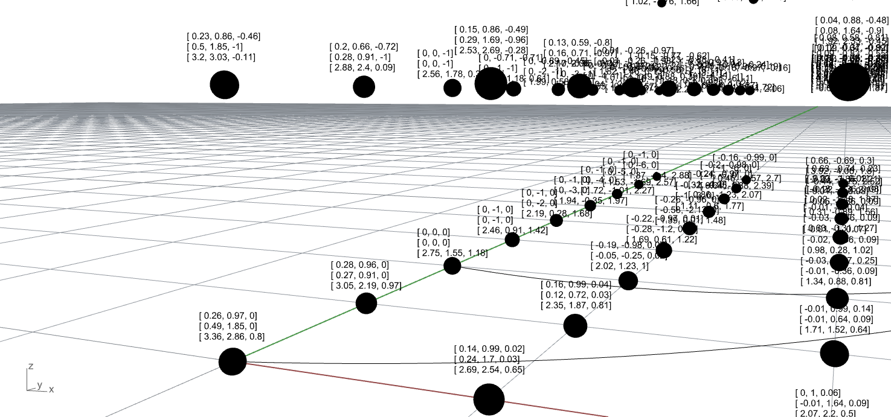
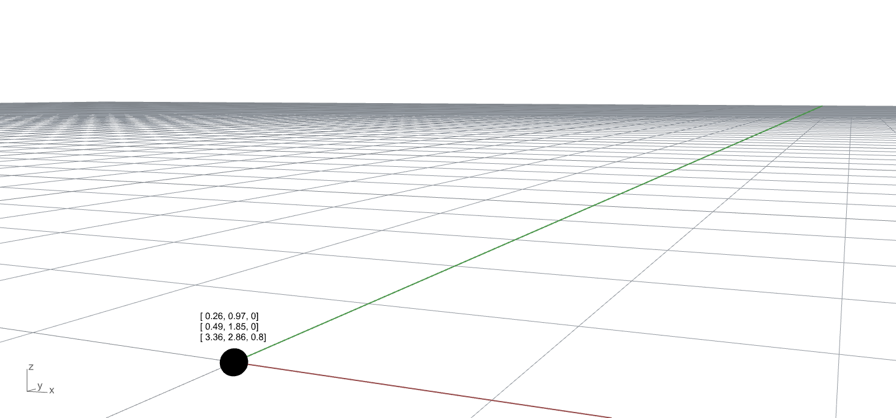

```python
import taichi as ti

ti.init(arch=ti.gpu)


```

# 1.Kernels and functions


## 1.1.Python-scope vs Taichi-scope

:pushpin: **difference**

Only taichi-scope has the chance to execute on GPU with parallel programming.

:pushpin:**how to distinguish?**

Code decorated by `@ti.kernel` or `@ti.func` is in the **Taichi-scope**. Outside is in the **Python-scope**.


## 1.2.Kernels

:pushpin: **What is a kernel?**

A Python function **decorated** by `@ti.kernel` is a **Taichi kernel**:

```python
@ti.kernel
def my_kernel():
    ...

my_kernel()
```

The literal meaning of *kernel* is kernel(core), therefore you can nest a kernel inside a kernel!

:pushpin: **Why kernel?**

Because its outermost for loop will be parallelized!


### 1.2.1.Arguments

Kernels *can have multiple arguments*.

:pushpin: **Why design in this way?**

It supports passing values from Python-scope to Taichi-scope conveniently.

:pushpin: **What to be noticed?**

The kernel argument must be type hinted since taichi is a **strongly-typed** language.

```python
@ti.kernel
def my_kernel(x: ti.i32, y: ti.f32):
    print(x + y)

my_kernel(24, 3.2)  # prints: 27.2
```


:warning: **`ti.Matrix` and `ti.Vector` are not supported yet** 


### 1.2.2.Return Value

:book: **NOTE**

Return value is only **OPTIONAL**.

```python
#TODO  Write a no return value taichi program
```


:pushpin: **What if I want return value?**

1.It must be a type hinted **scalar** value:

```python
@ti.kernel
def my_kernel() -> ti.f32:
    return 128.32

print(my_kernel())  # 128.32
```

2.It must be **ONE** scalar value. taichi does not support `ti.Matrix`, `ti.Vector` or Python-style tuple right now.


### 1.2.3.Advanced arguments

//TODO : This section approaches the advanced features.

Taichi also supports **template arguments** (see [Template metaprogramming](https://docs.taichi.graphics/docs/lang/articles/advanced/meta#template-metaprogramming)) and **external array arguments** (see [Interacting with external arrays](https://docs.taichi.graphics/docs/lang/articles/basic/external)) in Taichi kernels. Use `ti.template()` or `ti.ext_arr()` as their type-hints respectively.


## 1.3.Functions

:pushpin: **What is a function in taichi?**

A Python function decorated by `@ti.func` is a **Taichi function**:

```python
@ti.func
def my_func():
    ...

@ti.kernel
def my_kernel():
    ...
    my_func()  # call functions from Taichi-scope
    ...
```


:warning: **What should be noticed?**

Taichi functions can **ONLY** be called from **Taichi-scope**.


:book:**NOTE**

Unlike `taichi.kernel`,  Taichi functions can be nested.


### 1.3.1.Arguments and return value

Unlike `ti.kernel`, you can have **MULTIPLE** arguments and return value as they are **not required** to be type-hinted.

```python
@ti.func
def my_add(x, y):
    return x + y


@ti.kernel
def my_kernel():
    ...
    ret = my_add(24, 3.2)
    print(ret)  # 27.2
    ...
```

:pushpin:**pass by value**

Function arguments are passed by value, just like in C#.

`taichi`

```python
@ti.func
def add_one(x):
    x = x + 1  # won't change the original value of x


@ti.kernel
def my_kernel():
    ...
    x = 24
    add_one(x)
    print(x)  # 24
    ...
```

`C#`

```c#
static void AddNum(int num)
{
    num += 1;
    Console.WriteLine($"This is inside AddNum: {num}");
}

static void dowork()
{
    int num = 10;
    AddNum(num);
    Console.WriteLine($"This is in dowork: {num}");
}
```


:pushpin:**vector and matrix can be arguments**

Unlike kernels, functions **do support vectors or matrices** as arguments and return values.

```python
@ti.func
def sdf(u):  # functions support matrices and vectors as arguments. No type-hints needed.
    return u.norm() - 1

@ti.kernel
def render(d_x: ti.f32, d_y: ti.f32):  # Kernels do not support vector/matrix arguments yet.
    d = ti.Vector([d_x, d_y])
    p = ti.Vector([0.0, 0.0])
    t = sdf(p)
    p += d * t
    ...
```


:warning: **NO multiple return in one function**

Taichi currently does not support multiple `return` in one statement..

:x:

```python
# Error function - two return statements
@ti.func
def safe_sqrt(x):
  if x >= 0:
    return ti.sqrt(x)
  else:
    return 0.0
```

:heavy_check_mark:

```python
# Valid function - single return statement
@ti.func
def safe_sqrt(x):
  ret = 0.0
  if x >= 0:
    ret = ti.sqrt(x)
  else:
    ret = 0.0
  return ret
```


### 1.3.2.Advanced arguments

:pushpin:**pass by reference**

You can use `ti.template()` as a type hint, arguments are **forced to be passed by reference**:

```python
@ti.func
def my_func(x: ti.template()):
    x = x + 1  # This line will change the original value of x


@ti.kernel
def my_kernel():
    ...
    x = 24
    my_func(x)
    print(x)  # 25
    ...
```


no break point in parallel for-loop


atomic add?   +=


range for and struct for


kernel arguments, must be type-hinted, kernel is passed by value


ti.func() must be called inside ti.kernel

ti.func() are force-inlined?  what is force-inlined?


the variable in python once been compiled, it would not change!!!


# 2.Type system


## 2.1.Primitive types

- int8 `ti.i8`
- int16 `ti.i16`
- int32 `ti.i32`
- int64 `ti.i64`
- uint8 `ti.u8`
- uint16 `ti.u16`
- uint32 `ti.u32`
- uint64 `ti.u64`
- float32 `ti.f32`
- float64 `ti.f64`

## 2.2.Type Promotion

Low precision (operation with) High precision = High precision

- `i32 + f32 = f32` (integer + float = float)
- `i32 + i64 = i64` (less-bits + more-bits = more-bits)

## 2.3.Default precisions

You can set the precision as

```python
ti.init(default_fp=ti.f32)
ti.init(default_fp=ti.f64)

ti.init(default_ip=ti.i32)
ti.init(default_ip=ti.i64)
```


After setup the default, you can directly use `int` and `float`

```python
ti.init(default_ip=ti.i64, default_fp=ti.f32)


x = ti.field(float, 5)
y = ti.field(int, 5)
# is equivalent to:
x = ti.field(ti.f32, 5)
y = ti.field(ti.i64, 5)


def func(a: float) -> int:
    ...
# is equivalent to:
def func(a: ti.f32) -> ti.i64:
    ...
```


## 2.4.Type Casts

Remember, taichi is actually a strongly-typed language.

### 2.4.1.Implicit casts

:warning: The type of a variable is **determined on its initialization**. Hence, later operation will not affect its type.

Init: `float`  ->  Assign: `int`  ->  Eventually: `float`

```python
@ti.kernel
def foo():
    a = 3.14 #when a is init as float
    a = 1 #int 1 implicitly promoted
    print(a)  # 1.0
```

Init: `int`  ->  Assign: `float`  ->  Eventually: `int`

```python
@ti.kernel
def foo():
    a = 1 #when a is init as an int
    a = 3.14 #it will be int even though you assign a float
    print(a)  # 3
```


### 2.4.2.Explicit casts

Use `ti.cast()`

```python
@ti.kernel
def foo():
    a = 3.14
    b = ti.cast(a, ti.i32)  # 3
    c = ti.cast(b, ti.f32)  # 3.0
```


### 2.4.3.Casting vectors and matrices

:warning: Type casts applied to vectors/matrices are element-wise!!

```python
@ti.kernel
def foo():
    u = ti.Vector([2.3, 4.7])
    v = int(u)              # ti.Vector([2, 4])
    # If you are using ti.i32 as default_ip, this is equivalent to:
    v = ti.cast(u, ti.i32)  # ti.Vector([2, 4])
```


### 2.4.4.Bit-casts

Use `ti.bit_cast` to bit-cast a value into another data type. It is equivalent to `reinterpret_cast` in C++.

```python
@ti.kernel
def foo():
    a = 3.14
    b = ti.bit_cast(a, ti.i32) # 1078523331
    c = ti.bit_cast(b, ti.f32) # 3.14
```


## 2.5.Compound Types

:pushpin: **What is compound types?**

You can think of it as user-defined types. Vert similar to `typedef` in C++.

:pushpin: **How to create it?**

Use `ti.types`

```python
my_vec2i = ti.types.vector(2, ti.i32)
my_vec3f = ti.types.vector(3, float)
my_mat2f = ti.types.matrix(2, 2, float)
my_ray3f = ti.types.struct(ro=my_vec3f, rd=my_vec3f, l=ti.f32)
```


:bulb: **Similarity with Eigen**

Just like the Eigen library in C++, taichi has already defined many common data types for you.


### 2.5.1.Creating fields of certain type

Use `.field()` to create a field of certain type

```python
vec1 = my_vec2i.field(shape=(128, 128, 128))
mat2 = my_mat2f.field(shape=(24, 32))
ray3 = my_ray3f.field(shape=(1024, 768))

# is equivalent to:
vec1 = ti.Vector.field(2, dtype=ti.i32, shape=(128, 128, 128))
mat2 = ti.Matrix.field(2, 2, dtype=ti.i32, shape=(24, 32))
ray3 = ti.Struct.field({'ro': my_vec3f, 'rd': my_vec3f, 'l': ti.f32}, shape=(1024, 768))
```


### 2.5.2.Creating local variables of certain type

Compound types can be directly called to create vector, matrix or struct instances.

```python
ray1 = my_ray3f(0.0)            # ti.Struct(ro=[0.0, 0.0, 0.0], rd=[0.0, 0.0, 0.0], l=0.0)
vec1 = my_vec3f(0.0)            # ti.Vector([0.0, 0.0, 0.0])
mat1 = my_mat2f(1.0)            # ti.Matrix([[1.0, 1.0], [1.0, 1.0]])
vec2 = my_vec3f(my_vec2i(0), 1) # ti.Vector([0.0, 0.0, 1.0]), will perform implicit cast
ray2 = my_ray3f(ro=vec1, rd=vec2, l=1.0)
```


# 3.Fields

## 3.1.Intro

:pushpin: **What is Fields?**

**A global N-d array of elements**.

->  **global** : Similar to the concept of *field* in C# or other OOP languages, it is **GLOBAL** in both taichi and python scope.

->  **N-d** : N-dimensional

-> **elements** : it means that you can define what is that kind of element. It could be vector, matrix, scalar!


:pushpin: **dimension**

As mentioned above, the dimension is $N$ which means it can either be 0-scalar, 1-vector, 2-matrix.


:pushpin: **Scalar fields, Vector fields, Matrix fields** - type

You can see them as the **fields** filled with `scalar`, `vector`, and `matrix`.


:warning::thinking: **Why scalar in dimension and scalar in fields? What the heck?!**

I would rather think of it as a nested relationship. The former one(dimension) is actually the dimension. The latter one is what inside the element from the former one.


## 3.2.DIMENSION of field

> ​	`shape=()`



> ​	`shape=(x,)`




> ​	`shape=(x,y)`



> ​	`shape=(x,y,z)`




## 3.3.TYPE of field

a.k.a. What is **inside** the element?

:bulb: **scalar fields**

> ​	`ti.field(dtype=ti.f32, shape=(x, y, z)`


:bulb: **vector fields**

> ​	`ti.Vector.field(n=3, dtype=ti.f32, shape=(x, y, z))`



:bulb: **matrix**

> ​	`ti.Matrix.field(n=3, m=3, dtype=ti.f32, shape=(x, y, z))`




## 3.4.Access elements of fields

As you see above, the field is composed by **2** parts:

- **dimension**
- **type**

:star:Same logic apply to access the elements in a field. Use `[][]` to access.

:star:The **1st** `[]` corresponds to dimension, **2nd** `[]` corresponds to type.


### 3.4.1.Access scalar fields

:lock:field:    `heat_volume=ti.field(dtype=ti.f32, shape=(10, 20, 30))`

:thinking:analyze:     **dimension**:3,x-y-z;  **type**: scalar

:key:access:    `heat_volume[i,j,k]` is a scalar


:lock:field:    `pixels=ti.field(dtype=ti.f32, shape=(1920, 1080))`

:thinking:analyze:     **dimension**:2,x-y;  **type**: scalar

:key:access:    `pixels[i,j]` is a scalar


:lock:field:    `my_birthday=ti.field(dtype=ti.i32, shape=())`

:thinking:analyze:     **dimension**:0, None;  **type**: scalar

:key:access:    `my_birthday[None]=28`


### 3.4.2.Access vector fields

:lock:field:    `force_field = ti.Vector.field(n=3, dtype=ti.f32, shape=(x, y, z))`

:thinking:analyze:     **dimension**:3, x-y-z;  **type**: vector

:key:access:    `force_field[i,j,k]` is a $3$-vector,  `force_field[i,j,k][p]=13` is a scalar


:lock:field:    `unit_x = ti.Vector.field(n=3, dtype=ti.f32, shape=())`

:thinking:analyze:     **dimension**:0, None;  **type**: vector

:key:access:    `unit_x[None]` is a $3$-vector, `unit_x[None][1]=13` is a scalar which is the 2nd scalar in vector.


### 3.4.3.Access matrix fields

:lock:field:    `strain_tensor_field = ti.Matrix.field(n=3, m=3, dtype=ti.f32, shape=(x, y, z))`

:thinking:analyze:     **dimension**:3, x-y-z;  **type**: matrix

:key:access:    `strain_tensor_field[i,j,k]` is a $3\cross 3$-matrix, `strain_tensor_field[i,j,k][p,q]=13` is a scalar which is in the $p$-row and $q$-column.


:lock:field:    `x = ti.Matrix.field(n=3, m=4, dtype=ti.f32, shape=())`

:thinking:analyze:     **dimension**:0, None;  **type**: matrix

:key:access:    `X[None]` is a $3\cross 4$-matrix, `X[None][p,q]=13` is a scalar which is in the $p$-row and $q$-column.


:warning: You **MUST** use `[None]` to access the 0-dimension field.



You can access it like `x[None][p, q]`  ,  `p` is the row index, `q` is the column index


## 3.5.Struct fields

:pushpin: **What is struct fields?**

a.k.a. It is field with  **user-defined** struct. Compare to taichi-defined fields, you just need to specify the "**type**" part.


```python
particle_field = ti.Struct.field({
    "pos": ti.types.vector(3, ti.f32),
    "vel": ti.types.vector(3, ti.f32),
    "acc": ti.types.vector(3, ti.f32),
    "mass": ti.f32,
  }, shape=(n,))
```

:thinking:analyze:     **dimension**:1, x;  **type**: user-defined type in dict format.


This can be done with compound type:

```python
vec3f = ti.types.vector(3, ti.f32)
particle = ti.types.struct(
  pos=vec3f, vel=vec3f, acc=vec3f, mass=ti.f32,
)
particle_field = particle.field(shape=(n,))
```


:pushpin:**How to use it?**

Members of a struct field can be accessed either locally or globally:

`locallly` here means the very inner value

`globally` here means the value or "property" can be modify in global

```python
# set the position of the first particle to origin
particle_field[0] # local ti.Struct
particle_field[0].pos = ti.Vector([0.0, 0.0, 0.0])

# access the 2nd particle, and set the 1st value as 1.0
particle_field[1].pos[0] = 1.0

# make the mass of all particles be 1
particle_field.mass # global ti.Vector.field
particle_field.mass.fill(1.0)
```


 


